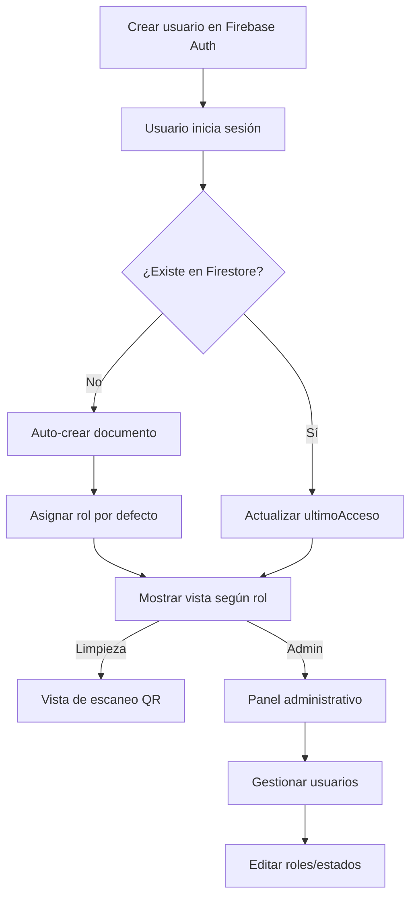

# Guía de Gestión de Usuarios

## 📋 Estructura de la Colección `usuarios`

### Ubicación en Firestore
```
usuarios/
  └── {UID del usuario de Firebase Auth}
      ├── email: string
      ├── nombre: string
      ├── rol: string ("limpieza" | "administrador")
      ├── activo: boolean
      ├── fechaCreacion: Timestamp
      └── ultimoAcceso: Timestamp
```

### Ejemplo de Documento
```javascript
{
  email: "juan.perez@empresa.com",
  nombre: "Juan Pérez",
  rol: "limpieza",
  activo: true,
  fechaCreacion: Timestamp(2025-01-21 10:00:00),
  ultimoAcceso: Timestamp(2025-01-21 14:30:00)
}
```

## 🔐 Roles y Permisos

### Rol: `limpieza`
- ✅ Escanear QR y registrar limpiezas
- ✅ Crear reportes de problemas
- ✅ Ver su propio historial
- ❌ Acceso al panel administrativo

### Rol: `administrador`
- ✅ Ver panel de control completo
- ✅ Ver estado de todos los baños
- ✅ Ver todos los reportes
- ✅ Ver historial completo
- ✅ **Gestionar usuarios** (editar roles, activar/desactivar)

## 👥 Cómo Crear Nuevos Usuarios

### Paso 1: Crear en Firebase Authentication

1. Ve a [Firebase Console](https://console.firebase.google.com/)
2. Selecciona tu proyecto: **rhserivicosgenerales**
3. Ve a **Authentication** > **Users**
4. Click en **Add User**
5. Ingresa:
   - **Email:** `usuario@empresa.com`
   - **Password:** Contraseña segura (mínimo 6 caracteres)
6. Click en **Add user**

### Paso 2: Primer Login (Auto-registro)

Cuando el usuario inicie sesión por primera vez:
1. La app detecta que no existe en Firestore
2. Crea automáticamente su documento en `usuarios/`
3. Asigna el rol por defecto:
   - Si el email contiene "admin" → **administrador**
   - Si no → **limpieza**

### Paso 3: Ajustar Rol (Opcional)

Si necesitas cambiar el rol después:
1. Inicia sesión como **administrador**
2. Ve a la sección **Gestión de Usuarios**
3. Click en **Editar** en el usuario
4. Cambia el **Rol** o **Estado**
5. Guarda los cambios

## 🔧 Gestión desde Panel Admin

### Ver Usuarios
- Muestra todos los usuarios registrados
- Información visible:
  - Nombre y email
  - Rol (Admin / Limpieza)
  - Fecha de creación
  - Último acceso
  - Estado (Activo/Inactivo)

### Editar Usuario
1. Click en **Editar**
2. Modificar:
   - Nombre completo
   - Rol (limpieza/administrador)
   - Estado (activo/inactivo)
3. Click en **Guardar**

### Activar/Desactivar Usuario
- **Desactivar:** El usuario no podrá iniciar sesión
- **Activar:** Restaura el acceso del usuario
- Click en el botón **Desactivar** o **Activar**

## 📝 Ejemplos de Usuarios Recomendados

### Usuarios de Limpieza
```
Email: limpieza1@empresa.com
Nombre: María González
Rol: limpieza

Email: limpieza2@empresa.com
Nombre: Pedro Martínez
Rol: limpieza

Email: limpieza3@empresa.com
Nombre: Ana López
Rol: limpieza
```

### Usuarios Administradores
```
Email: admin@empresa.com
Nombre: Carlos Ramírez
Rol: administrador

Email: supervisor.admin@empresa.com
Nombre: Laura Torres
Rol: administrador
```

## 🔒 Reglas de Seguridad

Las reglas de Firestore garantizan:
- ✅ Solo usuarios autenticados pueden acceder
- ✅ Solo usuarios activos pueden registrar limpiezas
- ✅ Los usuarios pueden leer información de otros usuarios
- ✅ Solo los administradores pueden modificar roles
- ✅ Los usuarios pueden actualizar su propio `ultimoAcceso`

## ⚠️ Importante

### No se pueden crear usuarios desde la app
El botón **Agregar Usuario** muestra un mensaje informativo.

**Razón:** Firebase Authentication requiere privilegios de administrador para crear usuarios. Debes crearlos desde Firebase Console.

### Auto-registro al primer login
Todos los usuarios que inicien sesión se registran automáticamente en Firestore con:
- Email de Firebase Auth
- Nombre: parte del email antes del @
- Rol: basado en si contiene "admin"
- Estado: activo
- Fecha de creación y último acceso

### Cambiar roles después
Los administradores pueden cambiar el rol de cualquier usuario desde el panel de gestión.

## 🚀 Flujo Completo



## 📞 Soporte

Para problemas con usuarios:
1. Verifica que el usuario existe en Firebase Authentication
2. Revisa la consola del navegador (F12) para errores
3. Verifica las reglas de Firestore en Firebase Console
4. Asegúrate de que el usuario está activo en la colección `usuarios`
